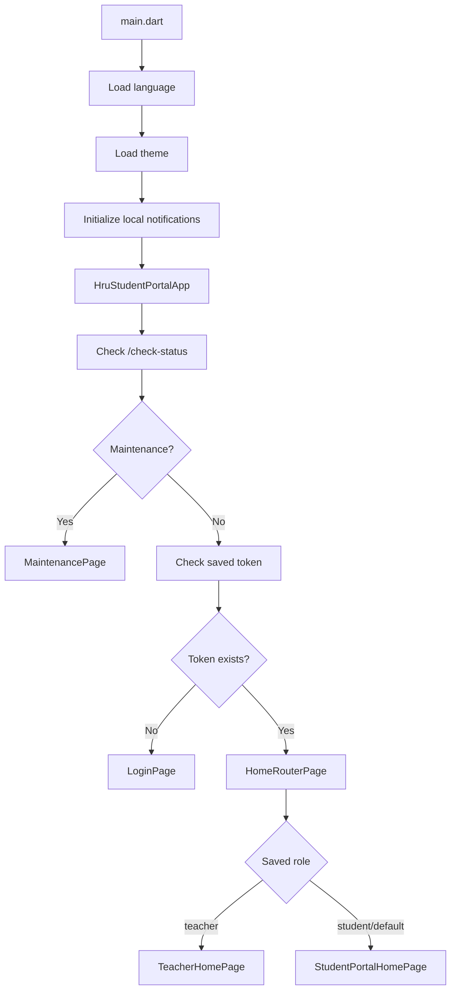
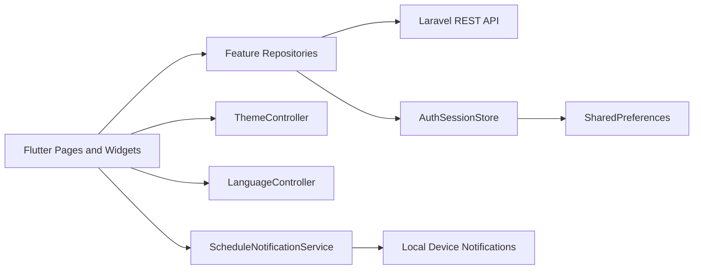
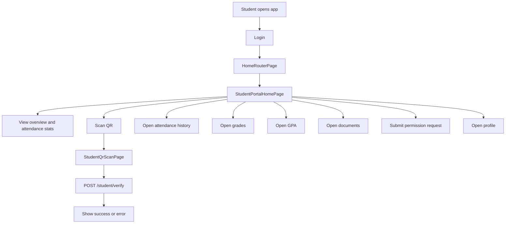
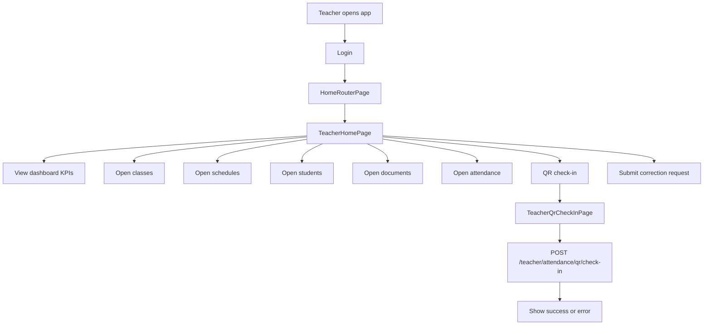
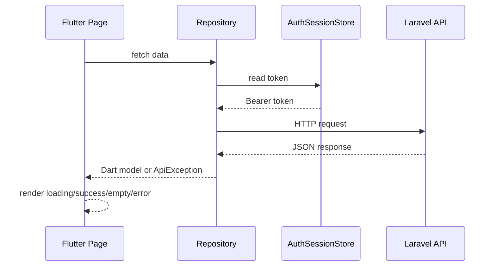
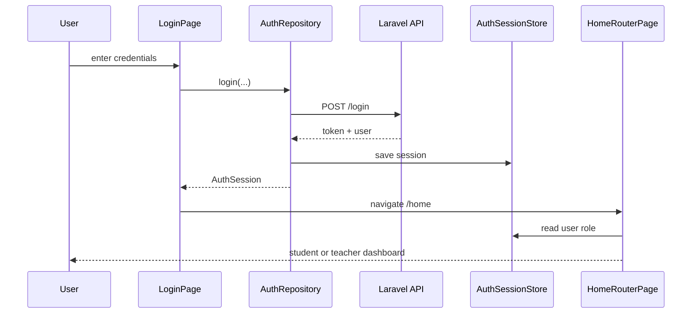

# HRU ATMS Project Documentation

This document explains the HRU ATMS Flutter project, its folder structure, GUI screens, role-based workflows, API flow, and development process.

HRU ATMS is a mobile-first Flutter application for HRU student and teacher attendance, academic records, schedules, documents, notifications, and permission requests. The app talks to a Laravel REST API, stores the logged-in session locally, and shows different interfaces for student and teacher users.

## Table Of Contents

1. [Project Overview](#project-overview)
2. [Technology Stack](#technology-stack)
3. [Project Structure](#project-structure)
4. [Application Startup](#application-startup)
5. [Architecture Diagram](#architecture-diagram)
6. [Routing](#routing)
7. [GUI Guide](#gui-guide)
8. [Student Workflow](#student-workflow)
9. [Teacher Workflow](#teacher-workflow)
10. [Feature Documentation](#feature-documentation)
11. [API And Data Flow](#api-and-data-flow)
12. [Authentication And Session Storage](#authentication-and-session-storage)
13. [Localization](#localization)
14. [Theme And UI System](#theme-and-ui-system)
15. [Local Notifications](#local-notifications)
16. [Testing And Quality](#testing-and-quality)
17. [Build And Run](#build-and-run)
18. [Maintenance Guide](#maintenance-guide)

## Project Overview

The app supports two main roles:

- Student: views dashboard, scans QR attendance, checks attendance history, grades, GPA, documents, profile, permissions, and notifications.
- Teacher: views dashboard, manages classes, schedules, students, documents, attendance, QR check-in, permission requests, profile, and notifications.

Main project path:

```text
hru_atms/
```

The application is written with a feature-first Flutter structure. UI pages call repository classes. Repositories call the backend API and convert JSON into Dart models.

## Technology Stack

Main dependencies from `pubspec.yaml`:

| Area | Package / Tool | Purpose |
| --- | --- | --- |
| App framework | Flutter | Cross-platform mobile, web, and desktop UI |
| Language | Dart SDK `^3.12.2` | Application code |
| UI | Material Design, Cupertino icons | Widgets and icons |
| HTTP | `http` | REST API requests |
| Local session | `shared_preferences` | Save auth token and user info |
| Fonts | `google_fonts` | Typography |
| Images/files | `image_picker`, `mime`, `http_parser` | Profile photo and multipart upload support |
| QR scanning | `mobile_scanner` | Student and teacher QR workflows |
| Notifications | `flutter_local_notifications`, `timezone` | Local schedule reminders |
| Documents | `syncfusion_flutter_pdfviewer`, `path_provider`, `open_filex` | Document preview/download support |
| Localization | `flutter_localizations` | English and Khmer app text |
| Testing | `flutter_test` | Unit and widget tests |
| Lints | `flutter_lints` | Static analysis rules |

## Project Structure

```text
lib/
  main.dart
  app/
    app.dart
    app_routes.dart
    l10n/
    theme/
  core/
    network/
    notifications/
    system/
  features/
    about/
    attendance/
    auth/
    classes/
    documents/
    gpa/
    grades/
    home/
    notifications/
    permissions/
    profile/
    schedules/
    students/
  shared/
    widgets/
assets/
  branding/
docs/
test/
android/
ios/
web/
windows/
linux/
macos/
```

Folder responsibilities:

| Folder | Responsibility |
| --- | --- |
| `lib/main.dart` | Initializes Flutter, language, theme, notifications, and starts the app |
| `lib/app/` | App widget, routes, localization, and themes |
| `lib/core/network/` | API configuration and API exception model |
| `lib/core/notifications/` | Local schedule notification service |
| `lib/core/system/` | Maintenance/system status check |
| `lib/features/*/data/` | Repository classes and API data parsing |
| `lib/features/*/domain/` | Domain models used by UI/data layers |
| `lib/features/*/presentation/` | Pages and widgets |
| `lib/shared/widgets/` | Reusable UI pieces such as loading, error, navigation, logo, language toggle |
| `test/` | Repository and widget tests |

## Application Startup

Startup begins in `lib/main.dart`.

Step by step:

1. Flutter binding is initialized.
2. A custom `ErrorWidget.builder` is registered so runtime widget errors show a friendly app error page.
3. `LanguageController.instance.load()` loads the saved language.
4. `ThemeController.instance.load()` loads the saved theme mode.
5. `ScheduleNotificationService.instance.initialize()` initializes local notifications.
6. `runApp(const HruStudentPortalApp())` starts the app.
7. `HruStudentPortalApp` checks backend maintenance status through `SystemStatusRepository`.
8. It checks whether a saved auth token exists through `AuthSessionStore`.
9. If maintenance mode is active, `MaintenancePage` appears.
10. If a saved session exists, `HomeRouterPage` opens.
11. If no saved session exists, `LoginPage` opens.

Startup diagram:



## Architecture Diagram



Common data pattern:

```text
Page Widget
  -> Repository
    -> AuthSessionStore token
    -> HTTP request
      -> Laravel API
    <- JSON response
  <- Dart model
Widget renders loading, success, empty, or error state
```

## Routing

Routes are centralized in `lib/app/app_routes.dart` and registered in `lib/app/app.dart`.

| Route | Page | Role / Purpose |
| --- | --- | --- |
| `/home` | `HomeRouterPage` | Reads role and opens student or teacher home |
| `/login` | `LoginPage` | Sign in |
| `/register` | `RegisterPage` | Teacher registration |
| `/attendance` | `StudentAttendancePage` | Student attendance history |
| `/attendance/scan` | `StudentQrScanPage` | Student QR attendance scan |
| `/student/permissions` | `StudentPermissionPage` | Student pre-permission requests |
| `/grades` | `StudentGradesPage` | Student grades |
| `/gpa` | `StudentGpaPage` | Student transcript/GPA |
| `/documents` | `StudentDocumentsPage` | Student documents |
| `/profile` | `StudentProfilePage` | Profile view and photo update |
| `/teacher/classes` | `TeacherClassesPage` | Teacher assigned classes |
| `/teacher/documents` | `TeacherDocumentsPage` | Teacher documents |
| `/teacher/students` | `TeacherStudentsPage` | Teacher student lists/details |
| `/teacher/schedules` | `TeacherSchedulesPage` | Teacher schedules |
| `/teacher/attendance` | `TeacherAttendancePage` | Teacher attendance sessions/history |
| `/teacher/attendance/qr-check-in` | `TeacherQrCheckInPage` | Teacher QR check-in |
| `/teacher/permissions` | `TeacherPermissionRequestPage` | Teacher attendance correction request |
| `/notifications` | `NotificationsPage` | Notification feed |
| `/about` | `AboutPage` | App information |

Some route constants exist for future features but currently go to the unknown-route error page if opened from quick actions:

```text
/courses
/payments
/library
/support
```

## GUI Guide

### Login Screen

File:

```text
lib/features/auth/presentation/pages/login_page.dart
```

What the user does:

1. Opens the app.
2. Chooses or enters role-specific login information.
3. Enters password or required credentials.
4. Taps sign in.
5. The app sends credentials to `/login`.
6. On success, token and user info are stored.
7. The app navigates to `/home`.

Error behavior:

- Validation errors are shown from backend response fields.
- Invalid server responses become an `ApiException`.
- Maintenance responses can open the maintenance page.

### Register Screen

File:

```text
lib/features/auth/presentation/pages/register_page.dart
```

Teacher registration workflow:

1. User opens register from the login page.
2. App loads registration options from `/register/options`.
3. Teacher enters name, email, phone, password, department, and specialization.
4. Teacher requests an email OTP through `/register/teacher/email-otp`.
5. Teacher enters the OTP.
6. App submits registration to `/register/teacher`.
7. After success, user returns to login.

### Student Home Screen

File:

```text
lib/features/home/presentation/pages/student_portal_home_page.dart
```

Main GUI sections:

1. Header with menu button, student name, notification shortcut, language toggle, and account menu.
2. Student overview card with student code, group, standing, sessions, present count, and remaining count.
3. QR scan card for student attendance.
4. Performance metrics.
5. Comparison chart/card.
6. Today schedule.
7. Next days this week.
8. Monthly attendance summary.
9. Semester result/GPA preview.
10. Student services quick actions.
11. Drawer navigation.
12. Bottom navigation.

Student drawer:

| Drawer item | Behavior |
| --- | --- |
| Home | Scrolls to overview |
| View profile | Opens `/profile` |
| Schedule | Scrolls to schedule section |
| Attendance | Opens `/attendance` |
| Grades | Opens `/grades` |
| GPA | Opens `/gpa` |
| Documents | Opens `/documents` |
| Permission | Opens `/student/permissions` |
| About | Opens `/about` |
| Logout | Calls logout and returns to `/login` |

Student bottom navigation:

| Tab | Route |
| --- | --- |
| Home | `/home` |
| Attendance | `/attendance` |
| Grades | `/grades` |
| GPA | `/gpa` |

### Teacher Home Screen

File:

```text
lib/features/home/presentation/pages/teacher_home_page.dart
```

Main GUI sections:

1. Header with menu, title, teacher name, notifications, language toggle, and account menu.
2. Main KPI hero card.
3. KPI grid for classes, students, sessions, attendance, and scans.
4. Scan attendance shortcut.
5. Class performance panel.
6. Needs attention panel.
7. Schedule panel.
8. Chat shortcut placeholder.
9. Drawer navigation.
10. Bottom navigation.

Teacher drawer:

| Drawer item | Behavior |
| --- | --- |
| Home | Scrolls to overview |
| View profile | Opens `/profile` |
| My classes | Opens `/teacher/classes` |
| Documents | Opens `/teacher/documents` |
| Students | Opens `/teacher/students` |
| Schedule | Opens `/teacher/schedules` |
| My attendance | Opens `/teacher/attendance` |
| Request | Opens `/teacher/permissions` |
| Notifications | Opens `/notifications` |
| About | Opens `/about` |
| Logout | Calls logout and returns to `/login` |

Teacher bottom navigation:

| Tab | Route |
| --- | --- |
| Home | `/home` |
| My classes | `/teacher/classes` |
| Schedule | `/teacher/schedules` |
| Request | `/teacher/permissions` |
| My attendance | `/teacher/attendance` |

## Student Workflow



Student attendance scan workflow:

1. Student taps the QR scan shortcut or opens `/attendance/scan`.
2. Camera scanner opens.
3. Student scans teacher/session QR code.
4. App submits QR data to `/student/verify`.
5. Backend validates token/session.
6. App shows success, warning, or error.
7. Student returns to home or attendance page.

Student academic workflow:

1. Student opens Grades or GPA.
2. App loads grades/transcript data from the API.
3. UI shows scores, grade points, letter grades, and semester/cumulative results.
4. Student can navigate back using bottom navigation or system back.

Student documents workflow:

1. Student opens Documents.
2. App loads `/student/documents`.
3. User chooses preview or download.
4. Preview uses document preview URL.
5. Download uses document download URL and opens the saved file.

Student permission workflow:

1. Student opens Permission page.
2. App loads existing permissions from `/student/permissions`.
3. Student fills a request form.
4. App posts request data to `/student/permissions`.
5. UI refreshes the list and shows request status.

## Teacher Workflow



Teacher dashboard workflow:

1. Teacher opens `/home`.
2. `TeacherDashboardRepository` loads `/teacher/summary`, `/teacher/classes`, and `/teacher/sessions`.
3. The page schedules local reminders for upcoming sessions.
4. UI shows summary, class performance, low-attendance classes, and recent sessions.

Teacher QR check-in workflow:

1. Teacher opens QR check-in page.
2. Camera scans a QR code.
3. App posts the token to `/teacher/attendance/qr/check-in`.
4. Backend validates the token.
5. App shows success or error and may return to the previous page.

Teacher attendance workflow:

1. Teacher opens My attendance.
2. App loads sessions from `/teacher/attendance/sessions`.
3. App loads corrections from `/teacher/attendance/corrections`.
4. Approved corrections are applied to session statuses.
5. UI groups and displays attendance records.
6. Teacher can monitor a session using `/teacher/session/{sessionId}/monitor`.

Teacher permission/correction workflow:

1. Teacher opens Request page.
2. App loads available attendance sessions.
3. Teacher selects session and permission type.
4. Teacher enters reason.
5. App posts request to `/teacher/attendance/corrections`.
6. UI shows pending, approved, or rejected status.

Teacher students workflow:

1. Teacher opens Students.
2. App loads teacher student data from teacher API paths.
3. UI groups students by class.
4. Teacher can search students and open student details.
5. Details include attendance statistics and history.

## Feature Documentation

### Auth

Important files:

```text
lib/features/auth/data/auth_repository.dart
lib/features/auth/data/auth_session_store.dart
lib/features/auth/data/teacher_registration_repository.dart
lib/features/auth/domain/models/auth_session.dart
lib/features/auth/domain/models/auth_user.dart
lib/features/auth/presentation/pages/login_page.dart
lib/features/auth/presentation/pages/register_page.dart
```

Endpoints:

| Method | Endpoint | Purpose |
| --- | --- | --- |
| POST | `/login` | Login |
| POST | `/logout` | Logout |
| GET | `/register/options` | Load teacher registration departments/options |
| POST | `/register/teacher/email-otp` | Send teacher email OTP |
| POST | `/register/teacher` | Register teacher account |

### Home

Important files:

```text
lib/features/home/data/student_dashboard_repository.dart
lib/features/home/data/teacher_dashboard_repository.dart
lib/features/home/presentation/pages/home_router_page.dart
lib/features/home/presentation/pages/student_portal_home_page.dart
lib/features/home/presentation/pages/teacher_home_page.dart
```

Endpoints:

| Method | Endpoint | Purpose |
| --- | --- | --- |
| GET | `/student/portal` | Student dashboard |
| GET | `/teacher/summary` | Teacher summary |
| GET | `/teacher/classes` | Teacher classes |
| GET | `/teacher/sessions` | Teacher sessions |

### Attendance

Important files:

```text
lib/features/attendance/data/student_attendance_repository.dart
lib/features/attendance/data/student_qr_attendance_repository.dart
lib/features/attendance/data/teacher_attendance_repository.dart
lib/features/attendance/presentation/pages/student_attendance_page.dart
lib/features/attendance/presentation/pages/student_qr_scan_page.dart
lib/features/attendance/presentation/pages/teacher_attendance_page.dart
lib/features/attendance/presentation/pages/teacher_qr_check_in_page.dart
```

Endpoints:

| Method | Endpoint | Purpose |
| --- | --- | --- |
| GET | `/student/classes` | Student class list for attendance/grades |
| GET | `/student/classes/{id}/history` | Student class attendance history |
| POST | `/student/verify` | Student QR attendance verification |
| POST | `/teacher/attendance/qr/check-in` | Teacher QR check-in |
| GET | `/teacher/attendance/sessions` | Teacher attendance sessions |
| GET | `/teacher/attendance/corrections` | Teacher correction requests |
| GET | `/teacher/session/{sessionId}/monitor` | Teacher session monitor |

### Grades And GPA

Important files:

```text
lib/features/grades/data/student_grades_repository.dart
lib/features/grades/presentation/pages/student_grades_page.dart
lib/features/gpa/data/student_gpa_repository.dart
lib/features/gpa/presentation/pages/student_gpa_page.dart
```

Endpoints:

| Method | Endpoint | Purpose |
| --- | --- | --- |
| GET | `/student/grades` | Student grades |
| GET | `/student/classes` | Student class list |
| GET | `/student/classes/{classId}/history` | Class details/history |
| GET | `/student/transcript` | Student GPA/transcript |
| GET | `/profile` | Student profile context |

### Documents

Important files:

```text
lib/features/documents/data/student_documents_repository.dart
lib/features/documents/data/teacher_documents_repository.dart
lib/features/documents/presentation/pages/student_documents_page.dart
lib/features/documents/presentation/pages/teacher_documents_page.dart
```

Endpoints:

| Method | Endpoint | Purpose |
| --- | --- | --- |
| GET | `/student/documents` | Student document list |
| GET | `/student/documents/{id}/preview` | Student document preview |
| GET | `/student/documents/{id}/download` | Student document download |
| GET | `/teacher/documents` | Teacher document list |

### Permissions

Important files:

```text
lib/features/permissions/data/student_permission_repository.dart
lib/features/permissions/data/teacher_permission_repository.dart
lib/features/permissions/presentation/pages/student_permission_page.dart
lib/features/permissions/presentation/pages/teacher_permission_request_page.dart
```

Endpoints:

| Method | Endpoint | Purpose |
| --- | --- | --- |
| GET | `/student/permissions` | Load student permissions |
| POST | `/student/permissions` | Submit student pre-permission |
| POST | `/teacher/attendance/corrections` | Submit teacher correction |
| GET | teacher repository paths | Load teacher sessions/corrections |

### Notifications

Important files:

```text
lib/features/notifications/data/notification_repository.dart
lib/features/notifications/presentation/pages/notifications_page.dart
```

Endpoints:

| Method | Endpoint | Purpose |
| --- | --- | --- |
| GET | `/chat/notifications` | Backend notifications |
| POST | `/chat/notifications/read` | Mark all read |
| GET | `/teacher/sessions` | Generated teacher schedule alerts |
| GET | `/student/portal` | Generated student schedule alerts |
| GET | `/teacher/student-permissions` | Generated teacher permission alerts |
| GET | `/student/permissions` | Generated student permission alerts |

### Profile

Important files:

```text
lib/features/profile/data/student_profile_repository.dart
lib/features/profile/presentation/pages/student_profile_page.dart
```

Endpoints:

| Method | Endpoint | Purpose |
| --- | --- | --- |
| GET | `/profile` | Load profile |
| POST | `/profile/photo` | Upload profile photo |

### System Status

Important file:

```text
lib/core/system/system_status_repository.dart
```

Endpoint:

| Method | Endpoint | Purpose |
| --- | --- | --- |
| GET | `/check-status` | Check maintenance mode |

## API And Data Flow

API base URL is configured in:

```text
lib/core/network/api_config.dart
```

Default base URLs:

| Platform | Base URL |
| --- | --- |
| Web | `http://localhost:8080/api` |
| Mobile/Desktop | `http://192.168.18.2:8080/api` |

Override API URL at runtime:

```bash
flutter run --dart-define=API_BASE_URL=http://YOUR_SERVER/api
```

Build with API URL:

```bash
flutter build apk --release --dart-define=API_BASE_URL=http://YOUR_SERVER/api
flutter build web --dart-define=API_BASE_URL=http://localhost:8080/api
```

Repository flow:



Error handling:

1. Repository decodes JSON.
2. Repository checks status code.
3. If the status is not 2xx, repository extracts `message`, `error`, or validation `errors`.
4. Repository throws `ApiException`.
5. Page displays retry, empty, validation, or maintenance state.

## Authentication And Session Storage

Session storage file:

```text
lib/features/auth/data/auth_session_store.dart
```

Saved values:

```text
auth_token
auth_user_name
auth_user_role
```

Authentication flow:



Logout flow:

1. Page calls `AuthRepository.logout()`.
2. Repository sends `/logout` if a token exists.
3. Local session is cleared even if the backend request fails.
4. App navigates to `/login`.

## Localization

Localization files:

```text
lib/app/l10n/app_localizations.dart
lib/app/l10n/language_controller.dart
```

Supported languages:

- English
- Khmer

Usage examples:

```dart
context.tr('Home')
context.l10n.format('{count} classes', {'count': '$count'})
```

The UI includes `LanguageToggleButton` in the student and teacher home headers.

## Theme And UI System

Theme files:

```text
lib/app/theme/app_colors.dart
lib/app/theme/app_theme.dart
lib/app/theme/theme_controller.dart
```

Theme modes:

- Light
- Dark
- System

Shared UI widgets:

```text
lib/shared/widgets/app_error_page.dart
lib/shared/widgets/app_loading_screen.dart
lib/shared/widgets/app_logo.dart
lib/shared/widgets/language_toggle_button.dart
lib/shared/widgets/maintenance_page.dart
lib/shared/widgets/student_bottom_navigation.dart
lib/shared/widgets/teacher_bottom_navigation.dart
lib/shared/widgets/theme_mode_selector.dart
```

Common UI behavior:

- Loading screens use `AppLoadingScreen`.
- Backend maintenance uses `MaintenancePage`.
- Unknown routes use `AppErrorPage`.
- Role navigation is shared in `StudentBottomNavigation` and `TeacherBottomNavigation`.

## Local Notifications

Notification service:

```text
lib/core/notifications/schedule_notification_service.dart
```

The service is initialized during app startup. Home dashboards schedule local reminders after schedule/session data loads.

Student notifications:

1. `StudentPortalHomePage` loads dashboard data.
2. Page sends today and week schedules to the notification service.
3. Service schedules class reminders and daily alarms.

Teacher notifications:

1. `TeacherHomePage` loads teacher sessions.
2. Page sends sessions to the notification service.
3. Service schedules session reminders and daily schedule alarms.

## Testing And Quality

Existing tests:

```text
test/auth_repository_test.dart
test/teacher_attendance_repository_test.dart
test/widget_test.dart
```

Recommended commands:

```bash
flutter pub get
dart format --set-exit-if-changed lib test
flutter analyze
flutter test
```

What to test when adding features:

1. Repository JSON parsing.
2. API error message extraction.
3. Token-missing behavior.
4. Important widget states: loading, success, empty, error.
5. Role-specific navigation.

## Build And Run

Install dependencies:

```bash
flutter pub get
```

Run app:

```bash
flutter run
```

Run with local backend:

```bash
flutter run --dart-define=API_BASE_URL=http://localhost:8080/api
```

Run with LAN backend:

```bash
flutter run --dart-define=API_BASE_URL=http://192.168.18.2:8080/api
```

Build Android APK:

```bash
flutter build apk --release
```

Build Android APK with API URL:

```bash
flutter build apk --release --dart-define=API_BASE_URL=http://YOUR_SERVER/api
```

Build web:

```bash
flutter build web --dart-define=API_BASE_URL=http://localhost:8080/api
```

Android release notes are also documented in:

```text
docs/ANDROID_APK_RELEASE_GUIDE.md
```

## Maintenance Guide

### Add A New Feature

1. Create feature folder:

```text
lib/features/new_feature/
```

2. Add repository:

```text
lib/features/new_feature/data/new_feature_repository.dart
```

3. Add models if needed:

```text
lib/features/new_feature/domain/models/
```

4. Add page:

```text
lib/features/new_feature/presentation/pages/new_feature_page.dart
```

5. Add route constant in:

```text
lib/app/app_routes.dart
```

6. Register route in:

```text
lib/app/app.dart
```

7. Add drawer or bottom navigation entry if needed.

8. Add tests for repository and critical UI behavior.

### Add A New API Call

1. Add method to the correct repository.
2. Read token from `AuthSessionStore` if endpoint is protected.
3. Build URL with `ApiConfig.baseUrl`.
4. Add `Accept: application/json`.
5. Add `Authorization: Bearer <token>` when required.
6. Decode JSON safely.
7. Throw `ApiException` on non-2xx status.
8. Convert JSON to a typed Dart model.
9. Update page loading/error/empty states.
10. Add tests for success and failure responses.

### Recommended Future Improvements

| Improvement | Benefit |
| --- | --- |
| Add shared API client | Reduces repeated URL/header/decode/error code |
| Extract JSON helper functions | Removes repeated `_asMap`, `_asList`, `_int` helpers |
| Split very large pages into widgets | Makes dashboard pages easier to maintain |
| Move localization to ARB files | Better translator and Flutter tooling support |
| Add more widget tests | Safer GUI changes |
| Add route guards | Better handling of wrong-role navigation |

### Pre-Merge Checklist

1. Run formatter.
2. Run analyzer.
3. Run tests.
4. Verify login/logout.
5. Verify student home and teacher home.
6. Verify QR camera permission on device.
7. Verify API URL for target environment.
8. Verify English and Khmer labels.
9. Verify small-screen layouts.
10. Verify unknown routes show friendly errors.

## Summary

HRU ATMS is a feature-first Flutter app with clean role-based navigation, repository-driven API access, local session storage, Khmer/English localization, light/dark themes, QR attendance workflows, document viewing, and schedule notifications.

The most important files to understand first are:

```text
lib/main.dart
lib/app/app.dart
lib/app/app_routes.dart
lib/features/home/presentation/pages/home_router_page.dart
lib/features/home/presentation/pages/student_portal_home_page.dart
lib/features/home/presentation/pages/teacher_home_page.dart
lib/core/network/api_config.dart
lib/features/auth/data/auth_repository.dart
lib/features/auth/data/auth_session_store.dart
```
